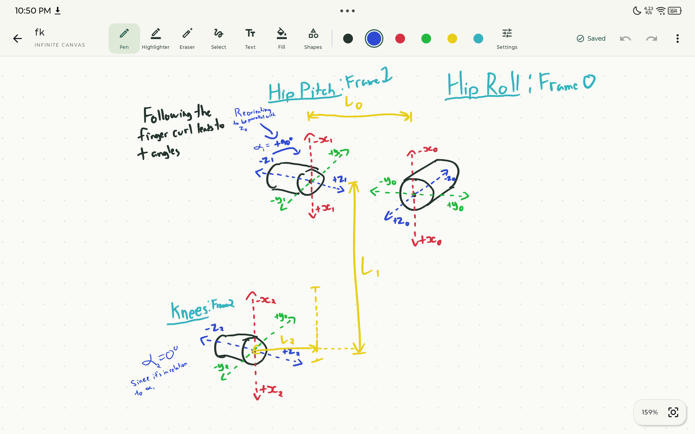

<p align="center">
  
</p>

<h1 align="center">Dotnote</h1>

<p align="center">
  A handwriting notebook for Android tablets, with a native iPadOS port.<br>
  Offline. No account. Free and open source, forever.
</p>

<p align="center">
  <a href="https://github.com/yufengliu15/dotnote/releases/latest">Download</a> ·
  <a href="docs/README.md">Docs</a> ·
  <a href="CHANGELOG.md">Changelog</a>
</p>



## What it is

Dotnote is an infinite dot-grid canvas, a pen, and a toolbar. You open it and write.

There is no sign-up, no subscription, no ads and no analytics. Notes are plain files on your device in a format you can read. Backups go to a GitHub repository you own.

## Platforms

Android is the full-featured app. The native iPad app shares its document engine through Kotlin Multiplatform and supports local handwriting, shapes, text, PDFs, images and portable vaults. See the [iPad build guide and feature boundary](docs/ipados-and-multiplatform.md) for setup and remaining platform differences.

The monorepo keeps platform apps in `android/` and `ios/`, with reusable Kotlin in `shared/`.

## Features

**Writing**

- Infinite canvas with pan, pinch zoom, momentum scrolling and a button that brings you back to your content.
- Pressure-sensitive pen (AndroidX Ink) and a highlighter that stays one flat opacity no matter how often you go over a spot.
- Lines, arrows, rectangles, ellipses and grids. Bucket fill for closed areas.
- Typed text boxes you can move, resize, recolour and edit.
- Lasso or tap to select. Move, resize, recolour or delete. 80 steps of undo.
- Six colour slots, each editable with a colour wheel or hex code. The stylus eraser button works where Android reports it.

**Imports**

- PDFs land on the canvas as locked pages with room around them to write. A page navigator jumps between them, and a small scrubber in the corner flips through pages: drag slowly for one page at a time, faster to skip ahead.
- Images and PowerPoint `.pptx` files, converted on the device. Nothing is uploaded.
- Export a view or the whole note to PDF, with your annotations.

**Organizing**

- Vaults, each with nested folders, its own settings and its own backup repository.
- Search by title. Drag notes into folders.
- Your five most recently opened notes sit at the top of the home screen.
- Save any note as a template and start new notes from it.
- Set Dotnote as the default notes app. On supported devices, the system note shortcut opens a quick note over the lock screen without exposing the rest of your library.

## Widgets

Three home-screen widgets. Long-press the home screen, then **Widgets → Dotnote**.

| Widget | What it does |
| --- | --- |
| **New note** | One tap to a blank note. Pick the vault and folder first. |
| **Recent notes** | The notes you opened most recently, across every vault. Resize it to show more. |
| **Calendar** | This month and next, side by side. Today is highlighted. |

## Backups

Dotnote saves every change locally within a few seconds. Backups are separate and optional.

- **GitHub.** Sign in with a device code, pick a repository, and Dotnote commits your vault there after a quiet period you choose (15 minutes to 6 hours). Every backup is a commit, so old versions stay in Git history. Credentials are encrypted with Android Keystore and never leave the device in a backup.
- **Folder export.** Copy a whole vault out through Android's Files app, or import one back.
- **ZIP.** A single-file backup of notes and PDFs.

This is backup and restore, not two-way sync. If the remote changed from another device, Dotnote stops and tells you instead of overwriting it.

Uninstalling or clearing app data deletes your local vaults. Back up first.

## The `.dotnote` file

Each note is one UTF-8 JSON file. A vault is an ordinary folder:

```text
University/
  .dotnote/vault.json
  attachments/lecture-3.pdf
  Signal processing [id]/
    .folder.json
    Week 1 [id].dotnote
```

Inside a note, every stroke, shape and text box is an item with an ID, colour, width and points:

```json
{
  "format": "dotnote",
  "version": 1,
  "title": "Week 1",
  "document": {
    "dots": true,
    "camera": [40.0, 40.0, 1.0],
    "items": [
      { "kind": "LINE", "color": -14339026, "width": 3.0,
        "points": [[0, 0], [100, 50]] }
    ]
  }
}
```

The format is versioned, and new versions of the app always open old notes. You can diff it, grep it, script against it, or walk away with it. Full spec: [docs/data-model-and-format.md](docs/data-model-and-format.md).

## Install

Download the APK from [Releases](https://github.com/yufengliu15/dotnote/releases/latest) and open it on your tablet. Android will ask you to allow installs from that source.

After that, update from inside the app: **Version & updates → Check for updates**. Downloads are checked against the release signature before Android's installer opens. Install updates over the existing app. Do not uninstall first.

Requires Android 10 or newer. Built for tablets with a stylus. If your pen registers as a finger, turn on **Writing settings → Draw with a finger**.

## Not included

No handwriting recognition, no cloud sync, no collaboration. Text inside imported PDFs is not searchable. These may change; the minimalism will not.

## Build

JDK 17 and Android SDK 36.

```sh
./gradlew :app:assembleDebug :app:testDebugUnitTest :app:lintDebug
```

Set `ANDROID_HOME`, or put `sdk.dir=/path/to/sdk` in `local.properties`.

The engineering docs in [docs/](docs/README.md) cover architecture, rendering, storage, the backup protocol and the release process. Release notes live in [CHANGELOG.md](CHANGELOG.md) and test evidence in [VALIDATION.md](VALIDATION.md).

## License

Dotnote is free and open source under the [MIT License](LICENSE). It will never have a paid tier.
