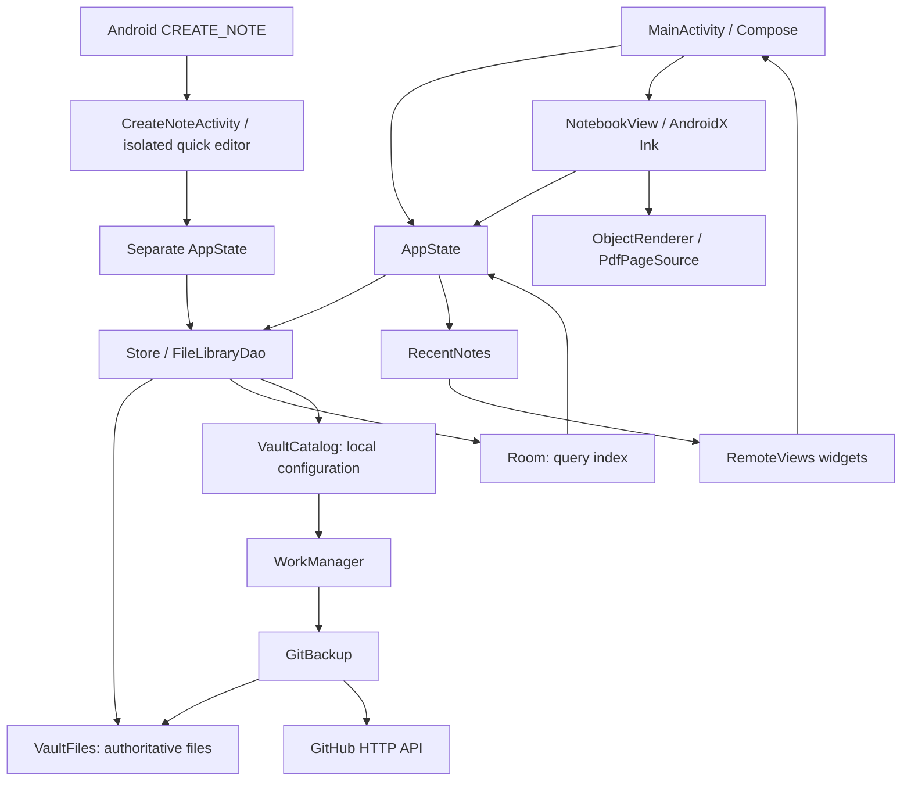

# Architecture and source map

[Documentation index](README.md)

## Runtime structure

The monorepo has one Android Gradle application module (`android/app`, task path `:app`), a Kotlin Multiplatform `shared` module, and a native iPad app in `ios` (see [iPadOS architecture](ipados-and-multiplatform.md)). The Android app has one exported launcher activity plus a separate exported system-note activity, activity-scoped `AndroidViewModel`, and no custom application class or dependency-injection framework. Production Kotlin is in package `dev.dotnote.app`.

## Production source map

All paths below are relative to this documentation directory. The table covers every production Kotlin file at the documented baseline.

| File | Responsibility and principal types |
| --- | --- |
| [MainActivity.kt](../android/app/src/main/java/dev/dotnote/app/MainActivity.kt) | Activity intents and immersive navigation bar; Compose theme, library, editor, toolbar, folder operations, writing settings, Android file-picker launchers |
| [CreateNoteActivity.kt](../android/app/src/main/java/dev/dotnote/app/CreateNoteActivity.kt) | Exported Android notes entry point; fresh private quick-note editor, lock-screen launches, independent tasks and configuration restoration |
| [DefaultNotes.kt](../android/app/src/main/java/dev/dotnote/app/DefaultNotes.kt) | Notes-role availability/current-holder checks and public default-app settings entry |
| [AppUpdates.kt](../android/app/src/main/java/dev/dotnote/app/AppUpdates.kt) / [UpdateDialog.kt](../android/app/src/main/java/dev/dotnote/app/UpdateDialog.kt) | Manual GitHub release checks, bounded downloads, APK verification and user-confirmed installer handoff |
| [AppState.kt](../android/app/src/main/java/dev/dotnote/app/AppState.kt) | `AppState`; selected store, editor state, save queue, action mutex, settings persistence, vault switching, PDF/backup UI actions |
| [Document.kt](../shared/src/commonMain/kotlin/dev/dotnote/app/Document.kt) | Immutable scene and geometry: `Pt`, `Bounds`, `Transform`, `Camera`, `Item`, `Document`, `Tool`, `History`, `DocumentCodec`, hit tests, folder-cycle validation |
| [NotebookView.kt](../android/app/src/main/java/dev/dotnote/app/NotebookView.kt) | Custom `FrameLayout`; native live ink, completed scene, pointer ownership, pan/zoom, selection/eraser/shapes, PDF worker and bitmap cache |
| [SceneTiles.kt](../android/app/src/main/java/dev/dotnote/app/SceneTiles.kt) | Raster tile cache for finished ink and markers: background tile thread, incremental edits, zoom levels, vector gap fallback |
| [FastJson.kt](../shared/src/commonMain/kotlin/dev/dotnote/app/FastJson.kt) | Streaming JSON reader for notes and org.json-compatible text writer |
| [Rendering.kt](../android/app/src/main/java/dev/dotnote/app/Rendering.kt) | Brush families, input serialization, `ObjectRenderer`, `PdfPageSource`, `PdfFiles.import/export`, Android matrix conversions |
| [FillTool.kt](../android/app/src/main/java/dev/dotnote/app/FillTool.kt) | Bounded visible-scene bucket rasterization, enclosed-region flood fill, portable vector coverage |
| [LibraryDrag.kt](../android/app/src/main/java/dev/dotnote/app/LibraryDrag.kt) | Long-press drag ownership, root-coordinate hit targets and lifted preview |
| [TextTool.kt](../android/app/src/main/java/dev/dotnote/app/TextTool.kt) | Note-scoped text drafts/dialog, StaticLayout measurement and text item construction |
| [ColorPicker.kt](../android/app/src/main/java/dev/dotnote/app/ColorPicker.kt) | Shared hue/saturation wheel, brightness slider, hex input, opaque selected color |
| [Store.kt](../android/app/src/main/java/dev/dotnote/app/Store.kt) | Room entities/DAO/database and transactional chunked document reads; `Store` initialization, old database migration, file-to-index rebuild, legacy ZIP backup/restore |
| [FileLibraryDao.kt](../android/app/src/main/java/dev/dotnote/app/FileLibraryDao.kt) | `LibraryDao` wrapper: files first, index second; mutation locking, no-op suppression, recency metadata updates |
| [VaultFiles.kt](../android/app/src/main/java/dev/dotnote/app/VaultFiles.kt) | Path validation, atomic text, digest functions, JSON files, journal replay, directory layout, note/folder moves, snapshot |
| [VaultCatalog.kt](../android/app/src/main/java/dev/dotnote/app/VaultCatalog.kt) | `VaultInfo`, vault creation/list/selection/rename/publish; local backup configuration, dirty revisions, `VaultLocks`, delay calculation |
| [VaultTransfer.kt](../android/app/src/main/java/dev/dotnote/app/VaultTransfer.kt) | Storage Access Framework tree import/export using private staging directories |
| [VaultDocumentsProvider.kt](../android/app/src/main/java/dev/dotnote/app/VaultDocumentsProvider.kt) | Read-only Android Files integration, canonical-path containment, metadata queries |
| [GitHub.kt](../android/app/src/main/java/dev/dotnote/app/GitHub.kt) | Encrypted credentials, authentication token refresh, HTTP transport, repository listing, Git blobs/trees, verified downloads |
| [GitBackup.kt](../android/app/src/main/java/dev/dotnote/app/GitBackup.kt) | Work scheduling/worker, managed path rules, connect/disconnect, incremental commits, conflict checks, explicit restore |
| [VaultUi.kt](../android/app/src/main/java/dev/dotnote/app/VaultUi.kt) | Vault chooser/rename, GitHub authorization dialog, repository picker, backup controls and status |
| [NewNoteDialog.kt](../android/app/src/main/java/dev/dotnote/app/NewNoteDialog.kt) | Shared creation dialog, vault selection and nested-folder browsing |
| [RecentNotes.kt](../android/app/src/main/java/dev/dotnote/app/RecentNotes.kt) | Local most-recently-opened list, full folder labels, metadata refresh without changing recency |
| [NoteWidgets.kt](../android/app/src/main/java/dev/dotnote/app/NoteWidgets.kt) | Two widget providers, responsive RemoteViews, PendingIntents, widget action parser, serialized widget updates |

Resources are ordinary Android XML. [The manifest](../android/app/src/main/AndroidManifest.xml) registers the activity, two widget receivers and documents provider, plus internet/network-state permissions. [Data extraction rules](../android/app/src/main/res/xml/data_extraction_rules.xml) exclude app data from Android backup/transfer. `res/layout/widget_*.xml`, `res/xml/widget_*_info.xml`, `res/values/widget_strings.xml`, and `res/drawable/widget_*.xml` define widgets. The Compose UI is not built from XML layouts.

## Startup and navigation

1. `MainActivity.onCreate` enables edge-to-edge rendering, hides navigation bars with transient swipe reveal, and parses an initial widget action only for a fresh activity instance.
2. Compose obtains `AppState` through `viewModel()`. Its initial `Store` resolves `VaultCatalog.selected()`.
3. The catalog reuses a valid selected vault, otherwise chooses the first existing vault, otherwise creates “My notes” and marks it as the legacy migration target.
4. `Store.ready` starts IO initialization. Under the vault mutex it creates missing metadata, migrates legacy data if required, replays the file journal, reads the vault, and rebuilds the metadata-only Room index with batch upserts in one database transaction. Notes whose file stamp matches the app-private scan cache are not re-read; others are validated with a streaming parser without constructing a drawing scene.
5. `AppState.runAction` waits for readiness, loads writing settings, ends its initial switching state, and finishes local startup. An independent IO coroutine awaits readiness and reconciles pending backup jobs for all vaults; library availability does not wait for this scheduling or network operations.
6. `folders` and `notes` are eager StateFlows derived from the active store's Room flows using `flatMapLatest`. They switch source when the vault changes. List flows can initially expose cached index data before initialization completes; the startup UI hides the library until local initialization/settings loading finishes. Ordinary DAO reads await `ready`.
7. `note == null` shows the library. Otherwise `key(note.id)` creates the editor and its `NotebookView`. There is no navigation-component route graph.

An open note is read from its file after readiness. Document JSON decoding (a single streaming pass) runs on IO. Opening resets selection and undo history, sets the saved camera/document, and queues a recency update. The current open note is not restored after process death; the selected vault is persisted and startup returns to its library. Rotation retains `AppState`, including its open document and history, while Android Views are recreated.

## State ownership

| State | Owner / lifetime |
| --- | --- |
| Current document, active note/folder, tool, selection, history, saved/busy/message | `AppState`; activity ViewModel lifetime |
| Note content, camera, dot visibility | `.dotnote` file after saving |
| Palette, chosen color, width, grid rows/columns, finger mode, dock | Per-vault `.dotnote/settings.json`; legacy `writing` preferences also retained |
| Live pointer, predictions, live stroke, drag preview, native handoff IDs | `NotebookView`; never a substitute for committed document state |
| Dialog visibility, PDF export region, canvas reference | Editor/library Compose state, mostly `remember` |
| New-note draft title and destination | `rememberSaveable` in creation dialog |
| Selected vault, repository bindings and backup revisions | `VaultCatalog` SharedPreferences |
| Widget opening order | `RecentNotes` SharedPreferences, device-local |
| Credentials | Encrypted SharedPreferences plus Android Keystore key |

`AppState.revision` is a Compose redraw signal. `VaultCatalog.config(...).revision` is a persisted backup dirty counter. They are unrelated counters; do not interchange them.

## Concurrency and ordering

- UI events and Compose state run on the main thread. File, database, JSON-load, import/export and network work use IO where the implementation explicitly dispatches it.
- `AppState.actions` serializes high-level operations such as opening, switching, importing and closing. `runAction` shows a blocking busy overlay, awaits the current store, reports failures through `message`, and rethrows coroutine cancellation.
- `queue: Channel<Save>(UNLIMITED)` has one consumer. Each request captures its `Store`, note ID, immutable document and sequence. Editing snapshots enter the queue after three seconds without edits (one pending autosave whose deadline moves, not a coroutine per pan frame); explicit save/flush requests bypass the delay. The consumer drains everything queued and writes only the newest document per note/store; superseded background snapshots are skipped before encoding, flush barriers never are, and every coalesced request completes with that write's result. A document identical (same instance) to the last one written for the open note is not rewritten. Encoding and file writing run on IO. Only the latest sequence for the same currently open note/store can turn the save indicator to “Saved.”
- `flush()` cancels pending edit/camera debounce, queues the latest snapshot with a `CompletableDeferred`, and waits for success. Closing or switching aborts when it returns false. `save()` just enqueues; it does not synchronously guarantee disk durability.
- The separate unlimited `openings` queue processes `(Store, noteId)` in FIFO order on IO, under the root mutex. It re-reads current metadata before updating recency. Widget/history errors are deliberately isolated from saving.
- `VaultLocks.forRoot(root)` serializes file mutations, journal replay, index rebuild and snapshot staging in this process. `VaultLocks.upload(localId)` serializes repository operations for that vault. Uploads hold the root mutex only while staging, not during network transfer.
- `VaultCatalog` and `Credentials` each use synchronized monitors around preference access. `RecentNotes` has its own monitor. `NoteWidgets` has one executor for updates. Each `NotebookView` has one PDF executor because `PdfRenderer` access must be serialized, and one tile thread. The tile thread only reads immutable item lists and renders into bitmaps it allocated; results are installed on the UI thread, which also owns all tile state.

Locks are in-process mutexes keyed by absolute path/local ID, not cross-process filesystem locks. Do not add another process or an external writer without designing synchronization. `AppState` caches opened `Store` instances; they are not automatically closed/evicted by current code. Save/open channels are unbounded, so sustained overload is a profiling concern.

## Lifecycle and save semantics

`commit(items, before)` pushes one prior item list into history, changes the scene, increments redraw revision and schedules a debounced save. `preview(items)` changes the scene without history or persistence. A completed eraser/move/resize gesture commits once using its pre-gesture list.

Content and camera changes share a three-second save debounce; the autosave captures the scene current when it fires. Editor chrome reads the scene through derived state (zoom percentage, empty hint, selection details) and undo/redo through the edit revision, so camera frames do not recompose the editor. Writing preferences debounce by 400 ms; the flow captures the store alongside the serialized settings and emits `null` while switching. Settings are also saved explicitly before switching and on editor `ON_STOP`.

On `ON_STOP`, the editor settles finished native strokes, enqueues a document save and schedules settings persistence. This is best effort, not an OS-guaranteed shutdown transaction. Process termination before a queued write finishes can lose unsaved work. Normal back/switch/export paths use `flush()` where implemented. “Saved” reports completion of local file/index saving, not a GitHub backup.

`NotebookView.release()` settles finished strokes, marks itself disposed, stops the tile thread, queues PDF-source closure behind pending render work, shuts down the worker and evicts bitmaps. Late PDF callbacks check the disposed flag.
